# Kobo e-Books Update Checker

UserScript to checks if updates were available for the e-books you own.

[][greasyfork]
[][license]
[][greasyfork-stats]
[][workflow-nightly]

## Installation

1. Install one of the supported UserScripts manager ([Violentmonkey][violentmonkey] or [Tampermonkey][tampermonkey]), **Greasemonkey is NOT SUPPORTED**.
1. Grant the permission to the UserScripts manager for executing UserScripts. ([Guide][tampermonkey-permissions])
1. Install the UserScript from [Greasy Fork][greasyfork] or [GitHub releases][releases].

## Usage

To check update for the e-books in your Kobo library, first navigate to your library. You can choose to either check for [a single book](#check-for-a-single-book), [the current page](#check-for-the-current-page), or [the whole library](#check-for-the-whole-library).

Check result for a book will be cached if the final status for it is either “Latest”, “Outdated”, “Preview” or “Pre-order”. In those cases the book won’t be checked again to save on data usage.

### Check for a Single Book

1. Click the actions button on the library item.
1. In the menu, click the “Check Update” action.
1. Review the live-updating [indicator for the book status](#status-indicators-for-single-book-or-current-page).

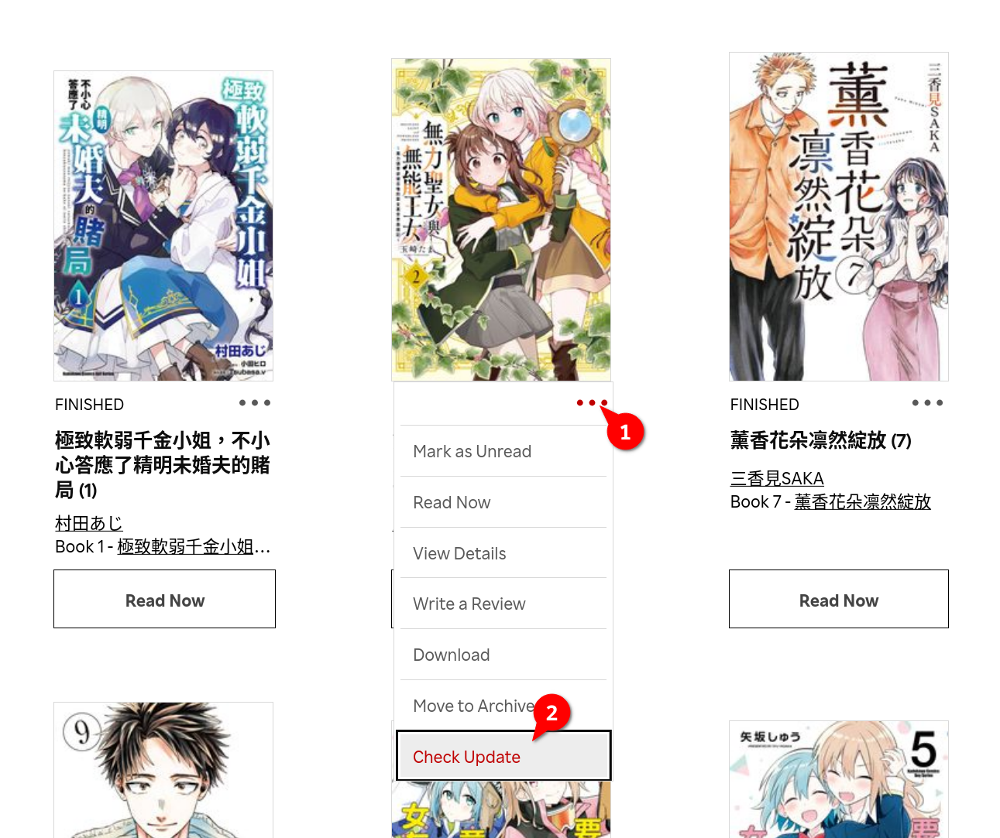

### Check for the Current Page

1. Click the “Check Update for Page” button at the top of the page.
1. Review the live-updating [indicators for the book statuses](#status-indicators-for-single-book-or-current-page) and the [results summary dialog](#results-summary-for-current-page-or-whole-library) when the checks finished.

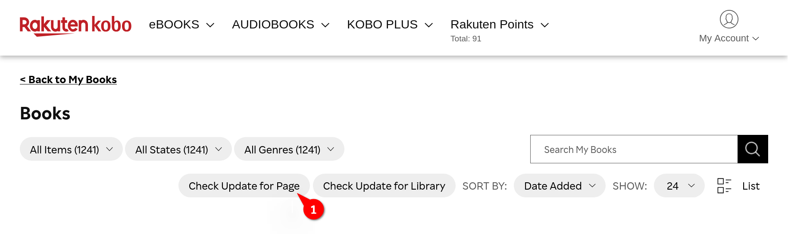

### Check for the Whole Library

1. Click the “Check Update for Library” button at the top of the page.
1. Confirm you want to check the whole library by clicking the “Start Checking” button.
1. When you previously checked the library, you’ll be asked if you want to reload the cached library. Click the “Reload Library” button when the filter criteria (e.g. search keyword, genre, item type) changed. Otherwise you can click the “Bypass Reloading” button to save time on reloading the library.
1. A progress dialog will then shows up for you to monitor the checking progress. You can cancel checking at any time.
1. Review the [results summary dialog](#results-summary-for-current-page-or-whole-library) when the checks finished.

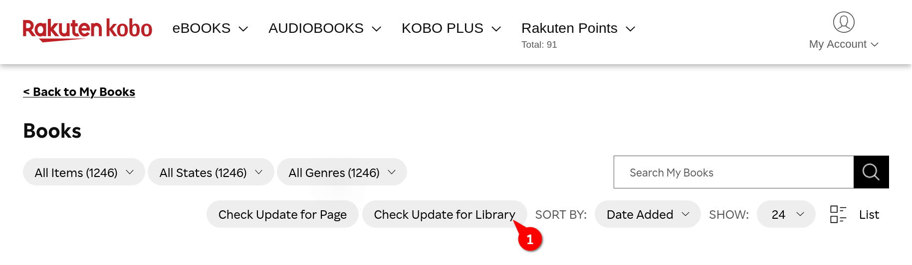

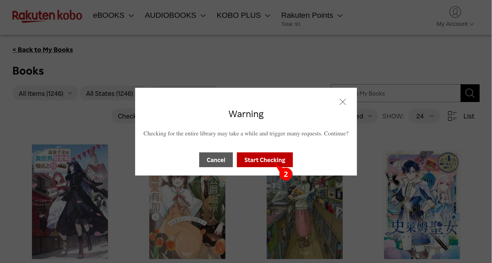

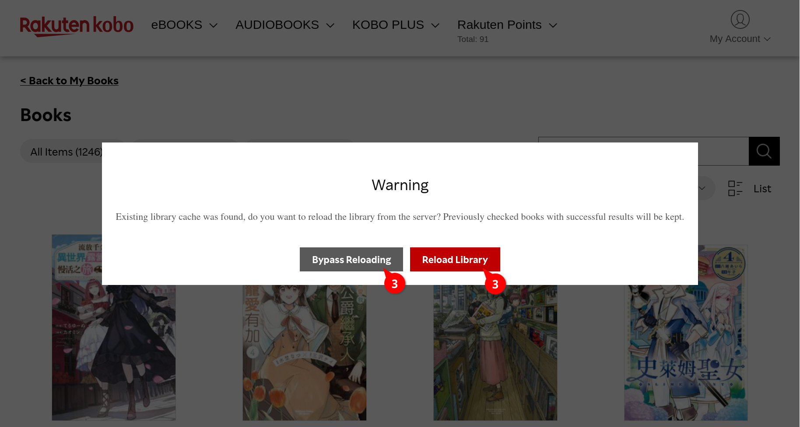

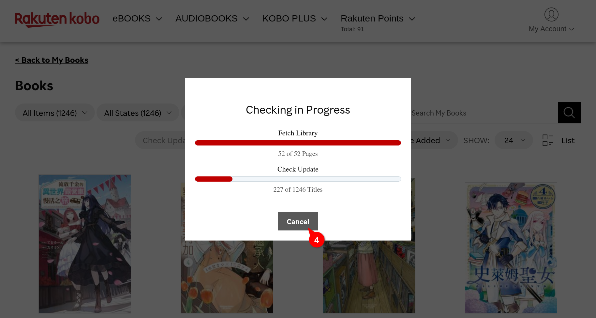

### Status Indicators (for Single Book or Current Page)

The status indicator is a live-updating text which reflect the current status of a particular library item. For “Failed” status, you can view the detailed failure message by clicking on the indicator.

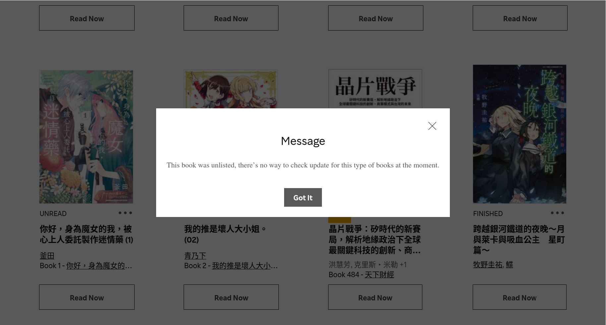

#### Appendix: All Possible Statuses

<table>
    <tr>
        <th scope="col" width="12.5%">Pending</th>
        <th scope="col" width="12.5%">Checking</th>
        <th scope="col" width="12.5%">Latest</th>
        <th scope="col" width="12.5%">Outdated</th>
        <th scope="col" width="12.5%">Preview</th>
        <th scope="col" width="12.5%">Pre-order</th>
        <th scope="col" width="12.5%">Skipped</th>
        <th scope="col" width="12.5%">Failed</th>
    </tr>
    <tr>
        <td>
            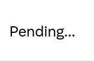
        </td>
        <td>
            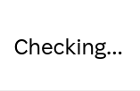
        </td>
        <td>
            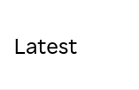
        </td>
        <td>
            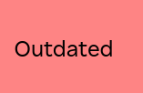
        </td>
        <td>
            
        </td>
        <td>
            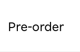
        </td>
        <td>
            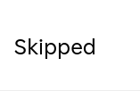
        </td>
        <td>
            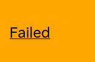
        </td>
    </tr>
</table>

### Results Summary (for Current Page or Whole Library)

At the results summary dialog, you can either:

1. Review the summary by toggling each of the status section; or
1. Save the [report](#report-for-current-page-or-whole-library) locally for future reference.

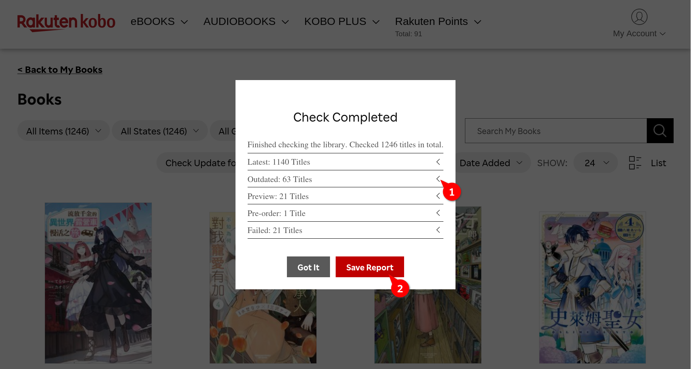

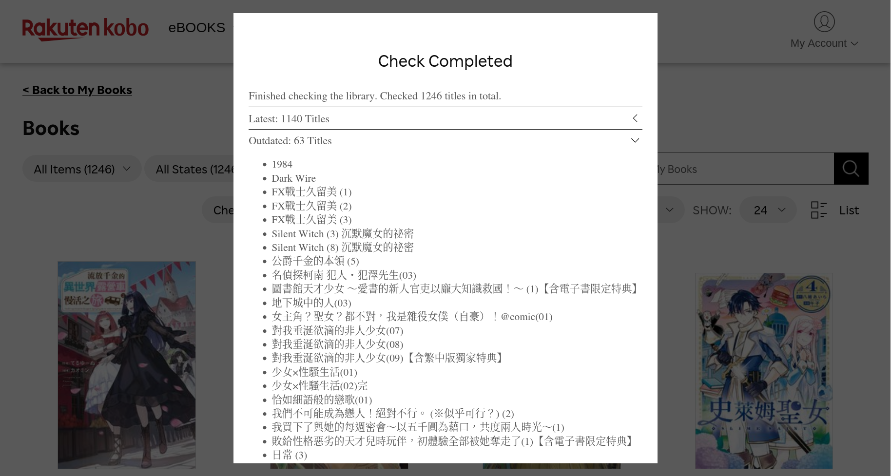

### Report (for Current Page or Whole Library)

## Development

[license]: https://github.com/JasonHK/kobo-ebooks-update-checker/blob/master/LICENSE
[releases]: https://github.com/JasonHK/kobo-ebooks-update-checker/releases/latest
[workflow-nightly]: https://github.com/JasonHK/kobo-ebooks-update-checker/actions/workflows/nightly.yml
[greasyfork]: https://greasyfork.org/scripts/482410
[greasyfork-stats]: https://greasyfork.org/scripts/482410/stats
[violentmonkey]: https://violentmonkey.github.io/
[tampermonkey]: https://www.tampermonkey.net/
[tampermonkey-permissions]: https://www.tampermonkey.net/faq.php?q=Q209
